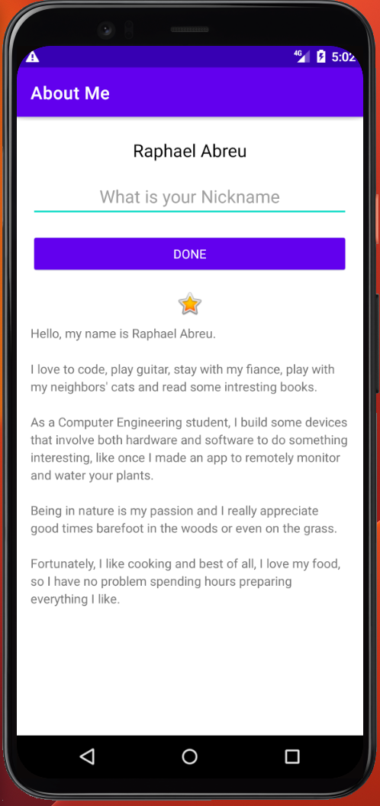
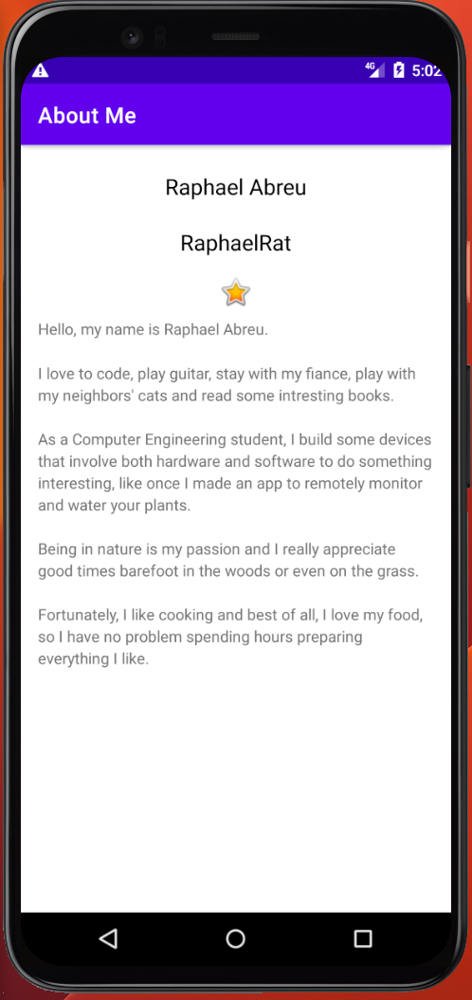

# AboutMe App

This repository contains the AboutMe app, which is the second project I developed as part of the "Developing Android Apps with Kotlin" course by Udacity. The app displays my name on the screen and provides some information about me, including my interests and hobbies. It also features a text input field where you can enter your nickname. Upon clicking the "Done" button, the input field disappears, and the app displays the entered nickname. Additionally, a cool feature I added, not covered in the course, is that when you click on the displayed nickname, the "Done" button reappears along with the text, allowing you to edit the created nickname.

## Project Overview
The AboutMe app served as an introduction to creating simple user interfaces and handling user input in Android development. It allowed me to showcase basic app components such as text views, image views, and buttons, as well as interact with user input through text input fields and button click events.

## Features
- Displays my name and information about me.
- Text input field for entering a nickname.
- Clicking the "Done" button hides the input field and displays the entered nickname.
- Clicking the displayed nickname reveals the "Done" button and text for editing.

## Demo Video
You can watch a demonstration of the app in action by expanding the 'Video' section below.

 Video
  
 
https://github.com/RaphaelRat/android-native-learning/assets/89277770/c672c9b3-a1d4-42bf-a72d-359d8142c5bf

 

## Screenshots

  
  

 

## Getting Started
To run the AboutMe app, you will need to have Android Studio installed on your machine. Simply clone or download this repository, open the project in Android Studio, and run it on an emulator or a physical device.

## Feedback
Your feedback and suggestions are welcome. If you have any ideas for improvements or features, please feel free to share them.
