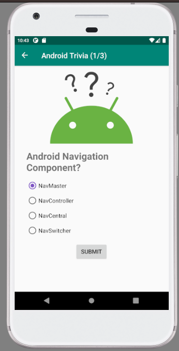

# Android Trivia App

The Android Trivia app is the third project I developed as part of the "Developing Android Apps with Kotlin" course by Udacity. This app challenges users with a series of trivia questions that they must answer correctly to win the game. Throughout the development of this app, I gained valuable experience in implementing navigation, animations, drawable menus, and various other functionalities.

## Project Overview
The Android Trivia app provided an opportunity for me to dive deeper into Android app development and explore advanced features. It focused on creating an engaging quiz experience with interactive elements and user feedback.

## Features
- Multiple-choice trivia questions for users to answer.
- Interactive UI elements to provide an engaging quiz experience.
- Navigation between different quiz sections and end screen.
- Animations to enhance the user interface and experience.
- Drawable menus for accessing additional features and options.

## Demo Video
You can watch a demonstration of the app in action by expanding the 'Video' section below.

 Video
  
  

 
https://github.com/RaphaelRat/android-native-learning/assets/89277770/227d679f-e9e9-4c53-9745-728c915419fd

  

## Screenshots

  
  
  

 

## Getting Started
To run the Android Trivia app, you will need to have Android Studio installed on your machine. Simply clone or download this repository, open the project in Android Studio, and run it on an emulator or a physical device.

## Feedback
Your feedback and suggestions are welcome. If you have any ideas for improvements or features, please feel free to share them.

## Copyright
 
 Copyright 2018, The Android Open Source Project
  
 Licensed under the Apache License, Version 2.0 (the "License");
 you may not use this file except in compliance with the License.
 You may obtain a copy of the License at
  
     http://www.apache.org/licenses/LICENSE-2.0
  
 Unless required by applicable law or agreed to in writing, software
 distributed under the License is distributed on an "AS IS" BASIS,
 WITHOUT WARRANTIES OR CONDITIONS OF ANY KIND, either express or implied.
 See the License for the specific language governing permissions and
 limitations under the License.
 