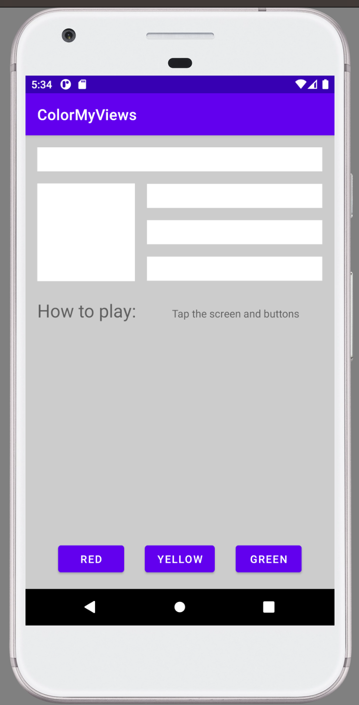
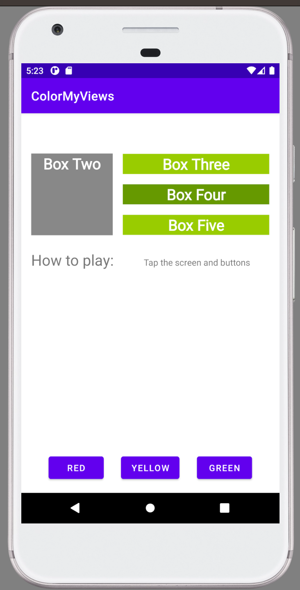
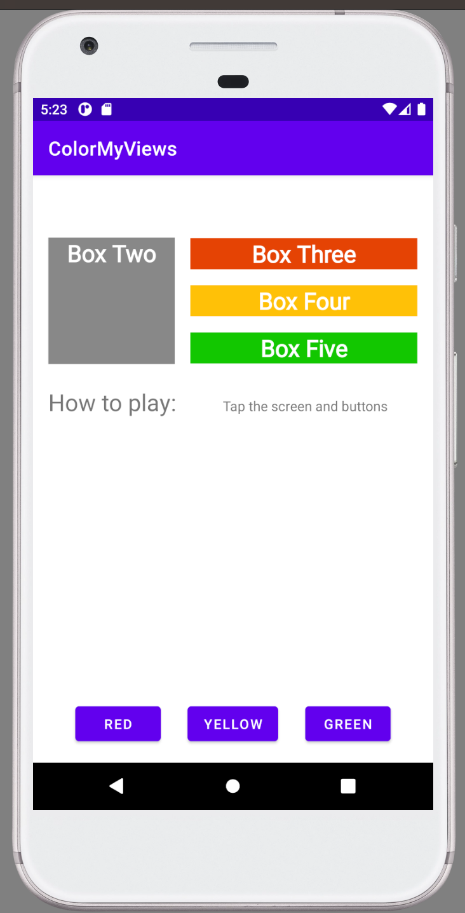

 # Color My Views App

This repository contains the Color My Views app, which is the third project I developed as part of the "Developing Android Apps with Kotlin" course by Udacity. The app features a set of boxes that change color when clicked, along with buttons at the bottom corner that change the color of specific boxes. There are a total of 5 boxes and 3 buttons. Additionally, clicking anywhere on the app's background also changes its color.

## Project Overview
The Color My Views app allowed me to explore creating interactive user interfaces and handling user interactions in Android development. It focused on implementing click events and dynamically changing the color properties of various UI elements.

## Features
- Clicking on a box changes its color.
- Buttons at the bottom corner change the color of specific boxes.
- Clicking anywhere on the app's background changes its color.

## Demo Video
You can watch a demonstration of the app in action by expanding the 'Video' section below.

 Video
  
  
https://github.com/RaphaelRat/android-native-learning/assets/89277770/f0b16da2-123a-432f-b6b6-4f4614ef9e56

## Screenshots

  
  
  

 

## Getting Started
To run the Color My Views app, you will need to have Android Studio installed on your machine. Simply clone or download this repository, open the project in Android Studio, and run it on an emulator or a physical device.

## Feedback
Your feedback and suggestions are welcome. If you have any ideas for improvements or features, please feel free to share them.

