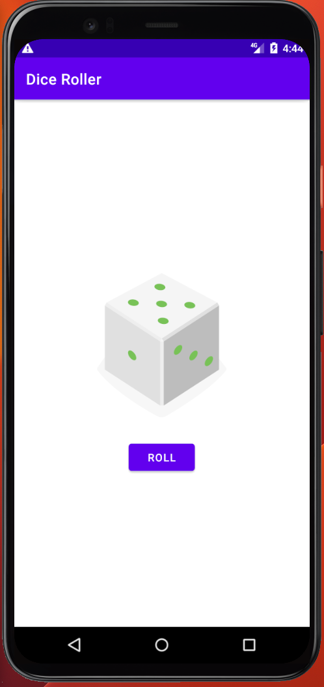
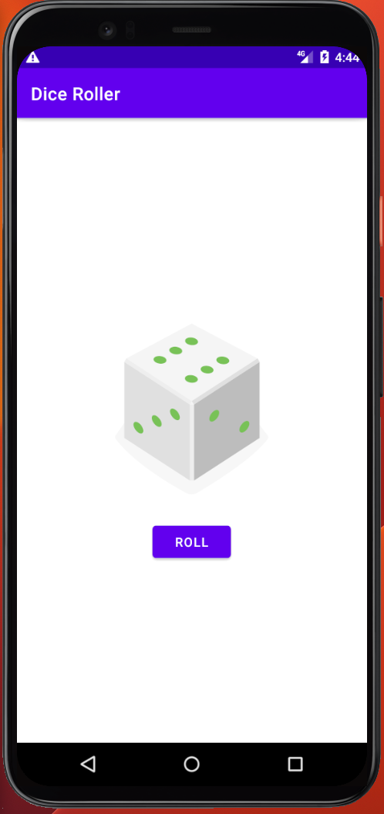

# Dice Rolling App

This is a simple dice rolling app created as part of my Android development learning journey. The app allows you to simulate rolling a dice by clicking a button, and it displays a random dice value on the screen. The app was built using six dice images, and each click generates a random dice value.

## Project Overview
The Dice Rolling App is the first project I developed as part of the "Developing Android Apps with Kotlin" course by Udacity. It served as an introduction to Android app development and helped me understand the basics of creating interactive user interfaces and handling user input.

## Features
- Clicking the "Roll" button simulates rolling the dice.
- Each roll displays a random dice value on the screen.

## Demo Video
You can watch a demonstration of the app in action by expanding the 'Video' section below.

 Video
  
  

 

https://github.com/RaphaelRat/android-native-learning/assets/89277770/46bf00ae-1c69-486f-8d8c-e3c6ae9432c9

  

## Screenshots

  
  

 

## Getting Started
To run the Dice Rolling App, you will need to have Android Studio installed on your machine. Simply clone or download this repository, open the project in Android Studio, and run it on an emulator or a physical device.

## Feedback
Your feedback and suggestions are welcome. If you have any ideas for improvements or features, please feel free to share them.

